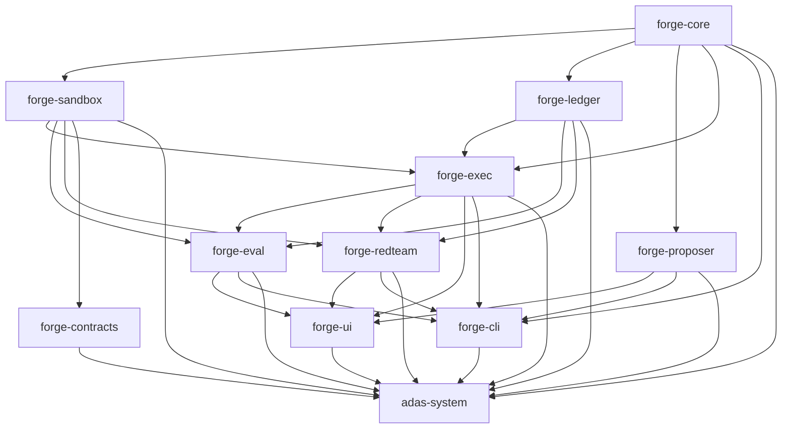

# Dependency Graph (reynard-full)

```mermaid
graph TD
  core[forge-core]
  sandbox[forge-sandbox]
  ledger[forge-ledger]
  proposer[forge-proposer]
  exec[forge-exec]
  eval[forge-eval]
  redteam[forge-redteam]
  contracts[forge-contracts]
  ui[forge-ui]
  cli[forge-cli]
  adas[adas-system]

  core --> sandbox
  core --> ledger
  core --> proposer
  core --> exec
  sandbox --> exec
  ledger --> exec
  exec --> eval
  sandbox --> eval
  ledger --> eval
  exec --> redteam
  sandbox --> redteam
  ledger --> redteam
  sandbox --> contracts
  proposer --> ui
  exec --> ui
  eval --> ui
  redteam --> ui
  core --> cli
  proposer --> cli
  exec --> cli
  eval --> cli
  redteam --> cli
  core --> adas
  sandbox --> adas
  ledger --> adas
  proposer --> adas
  exec --> adas
  eval --> adas
  redteam --> adas
  contracts --> adas
  ui --> adas
  cli --> adas
```
